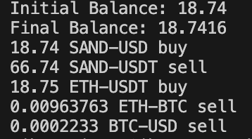
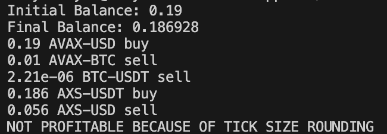

# Cross Currency Arbitrage Trader (WIP)
## About
This repo is a cross currency trader that scans exchanges for discrepencies in conversion rates to exploit profit. For example, say 1 USD = 1 INR = 1 JYP. There will moments of rate discripencies such that, at the same time, 1 USD = 2 JYP. In this instance, we can trade 1 USD -> 2 JYP -> 2 INR -> 2 USD. In real market, gains are not 100% but closer to 0.1%. Also, the program will currently only print out the most profitable conversion path. I am still working on executing trades on the exchange. NOTE: This program will never result in actual profits in trades because of exchange's transaction fees. Any potential profit will be eaten by fees.

## Run
```bash
make
./main
```
The simulation should print one of three things:  

1. A profitable path  
 

2. An unprofitable path due to tick size rounding  
 

3. No profitable path on exchange
"No Profitabe Conversion"


